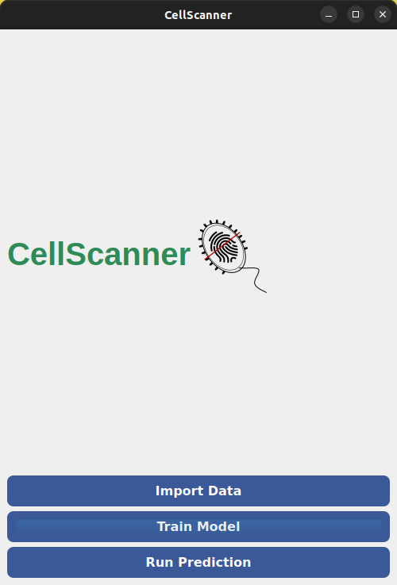

# CellScanner v2.0

CellScanner is a tool that counts different microbial species in flow cytometry data of communities separately with the help of a classifier that is trained on mono-cultures. It is implemented in Python and compatible with Windows, Mac and Linux.


## How to use it 


### Graphical User Interface (GUI)


#### Linux and macOS

To run CellScanner you first need to get it along with its corresponding dependencies. 
To this end, you may run the following chunk to get CellScanner and create a `conda` environment for it:

```bash
git clone https://github.com/msysbio/CellScanner.git
cd CellScanner
conda create -n cellscanner python=3.12.2
conda activate cellscanner
pip install -r requirements.txt
```

To run CellScanner with its GUI, you may now run:

```bash
# Always remember to activate your conda environment, if you set one for CellScanner
conda activate cellscanner
# If `python` returns an error message that is not there, try with `python3` instead
python cellscanner/Cellscanner.py
```

This will pop-up CellScanner where you can now import your data, fill in your training parameters and 
predict your species. 




Keep in mind that the CellScanner GUI is a PyQt5 app: it needs a desktop session to open its window (on Linux, an X11 or Wayland session).


#### Windows

Run the same steps in the **Anaconda Prompt** (or **Miniforge Prompt**) that comes with your conda installation.
If you do not have `git`, download the repository as a ZIP file (*Code* → *Download ZIP*) and unzip it instead of cloning.
Then start CellScanner from the root folder of the repository:

```bash
conda activate cellscanner
python cellscanner\Cellscanner.py
```

Run it directly in Windows rather than in WSL: Windows shows the GUI window itself.
You can also use the [Docker](#docker) image, which is the simplest way to run the CLI on Windows.


### Command Line Interface (CLI)


Assuming you already have CellScanner locally in a `conda` environment (see [above](./README.md#linux-and-macos)),
to run CellScanner using its CLI, you have first to fill in the [`config.yml`](./config.yml) file.
In this file, you may provide all the arguments you would do in the GUI case as well. 

Required arguments are mentioned as such, while it is important to remember that when providing monoculture data for the training step, their names (`species_names` in the yaml file) need to be in the same order as their filenames.

```yaml
species_files:
  directories:
    - directory:
        path: ./Testfiles/
        filenames:
          - BH_mono_48h_100.fcs
          - FP_mono_48h_100.fcs
          - RI_mono_48h_100.fcs
          - BT_mono_48h_100.fcs
        species_names:
          - Blautia
          - Faecalibacterium
          - Roseburia
          - Bacteroides
```
Once your configuration file is ready, you may run CellScanner CLI :

```bash
conda activate cellscanner
python cellscanner/CellscannerCLI.py --config config.yml
```


When using the CLI version, CellScanner is independent of PyQt5, thus no X11 issues should be occurred. 


## The logic 

CellScanner v2.0 is based on the [first version of the tool](https://github.com/Clem-Jos/CellScanner/tree/main). 

For an overview of what is under the hood, you may have a look on the [User manual of CellScanner v1.0](https://github.com/Clem-Jos/CellScanner/blob/main/CellScanner_1.1.0/CellScanner_user_manual.pdf).
For the new features that have been added, a manuscript is in process. :pencil:


## Docker

The image runs both the GUI and the CLI. Mount the directory with your input files to `/media`
in the container: CellScanner reads its inputs from there and writes its findings back to it.

**GUI** (Linux): first allow local connections to your display, then run the image:

  ```bash
  xhost +local:
  docker run --rm -e DISPLAY=$DISPLAY -v /tmp/.X11-unix:/tmp/.X11-unix -v ./Testfiles:/media hariszaf/cell_scanner
  ```

**CLI** (no display needed): put your `config.yml` in the mounted directory and use container paths
(`/media/...`) for the input files in it:

  ```bash
  docker run --rm --user $(id -u):$(id -g) -v ./Testfiles:/media hariszaf/cell_scanner python CellscannerCLI.py -c /media/config.yml
  ```

`--user` makes the output files belong to you rather than to root (Linux). In Windows PowerShell, leave it out and
write the folder as `-v ${PWD}\Testfiles:/media`.
Use `python CellscannerCLI.py --version` to check which CellScanner version an image contains.

**Building the image** (tagged with the version in `cellscanner/scripts/__init__.py`):

  ```bash
  VERSION=$(python -c "exec(open('cellscanner/scripts/__init__.py').read()); print(__version__)")
  docker build --build-arg CELLSCANNER_VERSION=$VERSION -t hariszaf/cell_scanner:$VERSION -t hariszaf/cell_scanner:latest .
  ```
