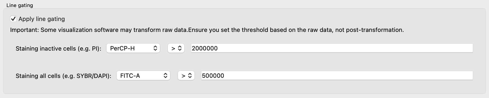
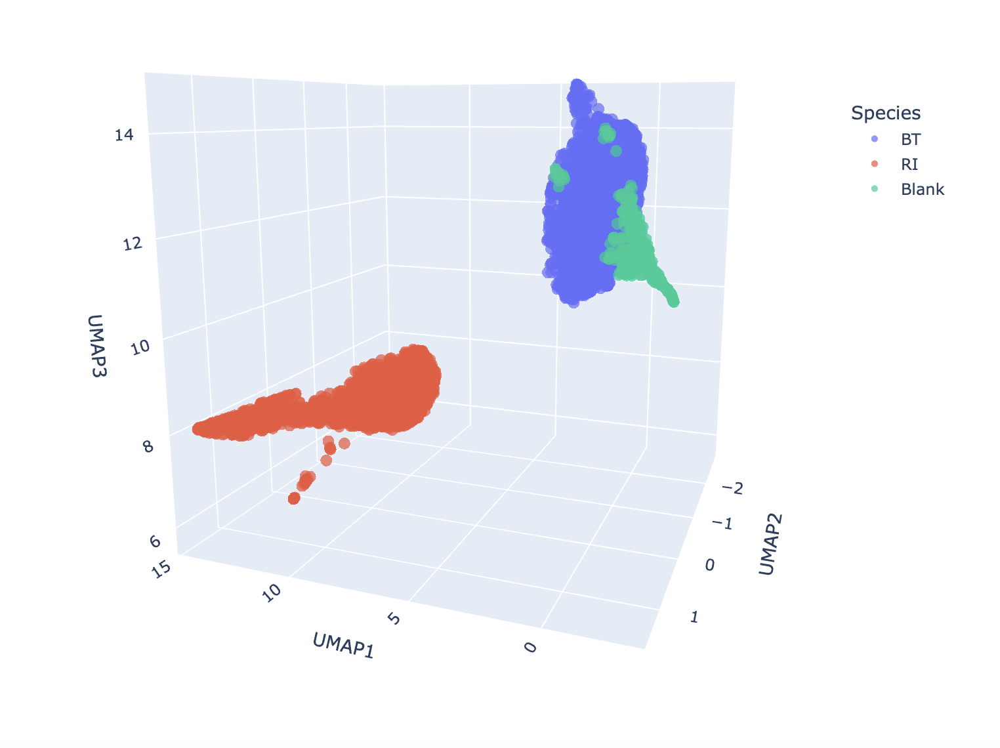
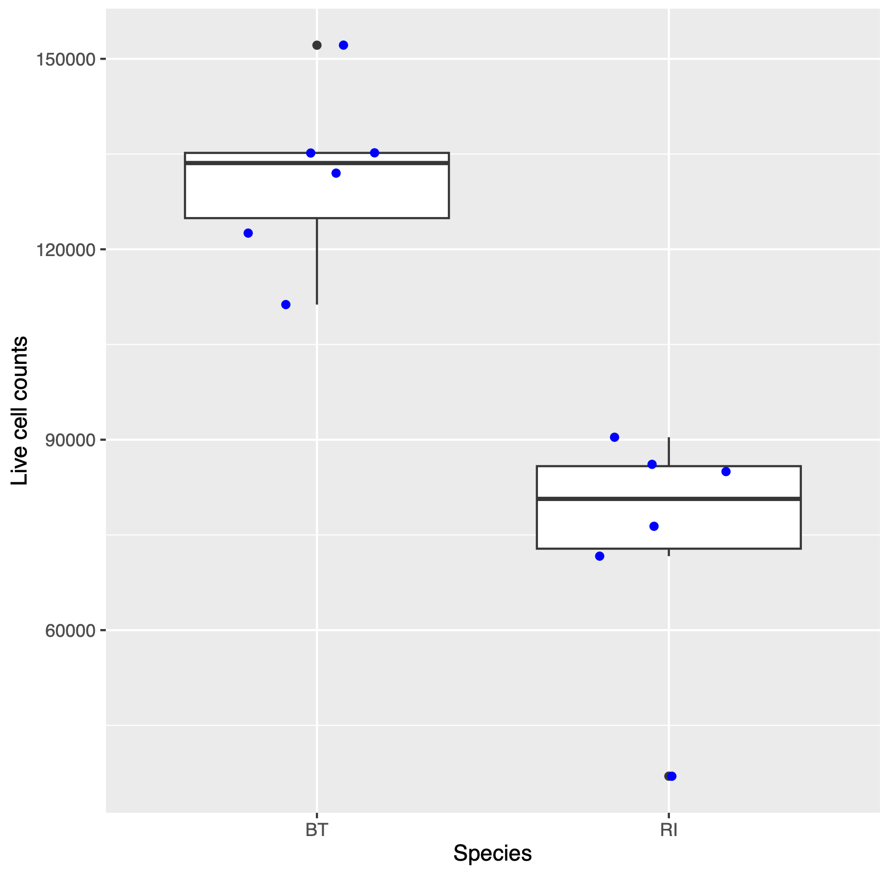

Graphical User Interface
============

## Introduction
For the tutorial, we will use flow cytometry files coming from a growth experiment with two gut bacterial species, *Roseburia intestinalis* (RI) and *Bacteroides thetaiotaomicron* (BT). These two species were grown in mono- and co-culture for up to 120 hours, as shown below:

In this experiment, dead/live staining with propidium iodide and SYBR-Green was applied. 
Propidium iodide is a stain that enters cells with broken membranes, which we therefore count as dead. 
SYBR-Green is a DNA-binding molecule that helps distinguish cells from background particles that do not contain DNA. 
Thus, viable cells should stain green and not red.

If you are interested in the biological background of the experiment, please check out the 
[article](https://www.nature.com/articles/s41396-023-01501-1).

The flow cytometry data for the growth curves shown above are available at 
[flowrepository.org](https://flowrepository.org/id/FR-FCM-Z6YM).
We are going to work here only with one time point (50 hours). You can find the files used in the tutorial 
[here](http://msysbiology.com/documents/CellScanner/CS2TutorialFiles.zip). 
 
When you open CellScanner, you see the graphical user interface (GUI) shown below. Please be patient, opening the GUI can sometimes take a minute.

## Import Data
The first step is to import the data. You can do this by clicking on **"Import Data"**. When you click the *Select blank file* button, you can navigate to the corresponding fcs files. When you click the *Add Species* button, a new button appears next to a text field that allows you to assign the name to the fcs files belonging to the same species.
Note that **you can select several files at once** for both blank and mono-culture files! 
Optionally, you can also specify an output directory where results will be saved. 
If you do not specify one, results will go in an output folder created on the fly inside the CellScanner directory. 
If you previously trained a model for your data, you can also re-use it. Here, we work with two blank files and three biological replicates for each monoculture, with the samples collected at 50 hours. 

 

## Train Model
Next, we open the **Train Model** panel. 
If the CellScanner window becomes too big for your screen, close the **Import Data** panel. 
Here, we are going to use default values as shown below. 
UMAP is run first to remove debris. 
Essentially, this is done by clustering events from blanks and monocultures and then removing events from monocultures that are too similar to events in blanks. 
Next, a model (a neural network) is trained on the filtered monocultures. You can **launch the model training step by clicking on** the green **Train** button.

 

**Optionally**, you can apply gating to the monocultures, which is then carried out before UMAP. If you wish to do so, please click the *Apply line gating* checkbox. In this example, samples were treated with SYBR Green and propidium iodide. The latter is a red flurescent stain that cannot pass the cell membrane. Thus, it can enter cells only if their membrane is ruptured and cells stained red are therefore treated as dead.
In contrast, SYBR Green is a membrane-permeable green fluorescent stain that binds to DNA. Thus, any event that is not green does not contain DNA and should better not be counted as a cell. The thresholds have to be specified as a function of the intensity values for the corresponding channels across all monocultures. Usually, the software accompanying your flow cytometer can visualise intensities in different channels as histograms and scatter plots, thereby helping you to select thresholds. Here, we will set the thresholds as follows:

 

The plot below illustrates the gating carried out. PerCP and FITC refer to the red and green fluorescence channel, respectively (H and A stand for height and area of the fluorescence signal). All events above the red line and all events to the left of the green line will be treated as dead cells or debris respectively and removed.

Model training should be fast (within one minute). 
Model performance files will be stored in a sub-folder in your specified output folder (if you did not specify one, then in the CellScanner folder). 
The sub-folder name starts with `working_files` and ends with a time stamp. 
It contains another folder called `model`, in which you will find a number of files encoding the trained neural network, a file called `model_statistics.csv` and two html files, `umap_Before_filtering.html` and `umap_After_filtering.html`, which will open in your browser when clicked. 
The first shows a UMAP projection before and the second one after filtering. 
An event is filtered if its neighbors in the UMAP embedding do not have the same label (the number of neighbors considered is among CellScanner's parameters). 
The `model_statistics.csv` file contains information about classification performance, including accuracy, precision, recall, F1 score and the confusion matrix.

This is the confusion matrix for our tutorial files:

| Species | Blank | BT | RI | 
| ----------- | ----------- | ------- | ----|
| Blank | 229 | 0 | 0 | 
| BT | 0 | 567 | 0 | 
| RI | 0 | 1 | 579 | 

The confusion matrix is computed by creating in-silico communities with known composition and feeding them to the trained model. It shows how well each species is separated from the other species and from debris (blank). Here, the model performed very well, with only one event that was misclassified. 

This good separation is also seen in the UMAP space plotted in `umap_After_filtering.html`:

## Run prediction
We are now ready to apply the trained neural network on one or several cocultures. 
For this, we open the **Run Prediction** panel by clicking on it. 
As with monocultures, several coculture files can be selected and imported at once. 
If more than one coculture is selected, the trained neural network will be applied to each coculture in turn. 
Here, we are importing six replicates of the coculture (btriA-F). 

Next, we specify three flow cytometer channels to be used in the visualization. Here, these are the forward scatter (FSC), side scatter (SSC) and green fluorescence (FITC) channel.

**Optionally, the "uncertainty" thresholding can be enabled** by clicking the checkbox next to 
*"Apply filtering on the predictions based on their uncertainty scores"*. 
Events that cannot be easily assigned to one species have a high **uncertainty** (entropy).
CellScanner automatically computes an uncertainty threshold that maximizes model performance and displays it in the field next to the checkbox for uncertainty filtering. If uncertainty thresholding is enabled, events with uncertainty above this threshold will be filtered out. Note that the threshold can be manually adjusted. 

Optionally, line gating can also be applied to the coculture. Here, we are going to use the same thresholds as for the monocultures.

Clicking *"Predict"* will then launch the prediction step. 

 

The prediction should also happen within one minute. The output is stored in a folder called "Prediction" (followed by a time stamp) that is either located in the specified output folder or the CellScanner folder.
For each coculture, the following files are generated (file names start with coculture name): 

- `3D_coculture_predictions_species.html` plots events in a 3D plot spanned by the three selected flow cytometer channels and colors them by species
- `3D_coculture_predictions_uncertainty.html` is the same with events colored by prediction uncertainty
- `prediction_counts.csv`, which contains the predicted counts for debris (blank), for each species, and also for the unknown events if uncertainty thresholding was enabled
- `raw_predictions.csv`, which is the fcs file of the coculture extended with prediction results (labels and, if enabled, uncertainties) 
- `uncertainty_counts.csv`, which lists the number of uncertain events per label if uncertainty thresholding was enabled

In addition, two subfolders are created:

- subfolder `gated` provides counts and a plot on gating if stains were provided for each coculture
- subfolder `heterogeneity_results` quantifies and visualizes overall and species-specific heterogeneity, also for each coculture 

If more than one coculture file was provided, `merged_prediction_counts.csv` will list the counts for each coculture.

Below is the result for the six coculture replicates:

| Species | Coculure 1 | Coculture 2 | Coculture 3 | Coculture 4 | Coculture 5 | Coculture 6 |
| ----------- | ----------- | ------- | ----| -----| ---- | ------ | 
| BT | 144620 | 165580 | 146087 | 147948 | 133500 | 139105 |
| RI | 70883 | 29756 | 79420 | 65690 | 86624 | 82162 |
| Blank | 755 | 804 | 767 | 682 | 1563 | 892 |
| Unknown | 4573 | 3455 | 4300 | 4228 | 28639 | 13516 |

At 50 hours, the coculture is dominated by *Bacteroides thetaiotaomicron* according to CellScanner. Note that we computed viable cell counts since we filtered out dead cells using the propidium iodide stain.

