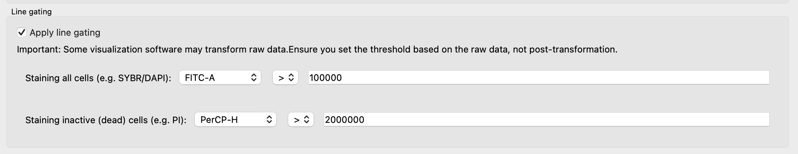
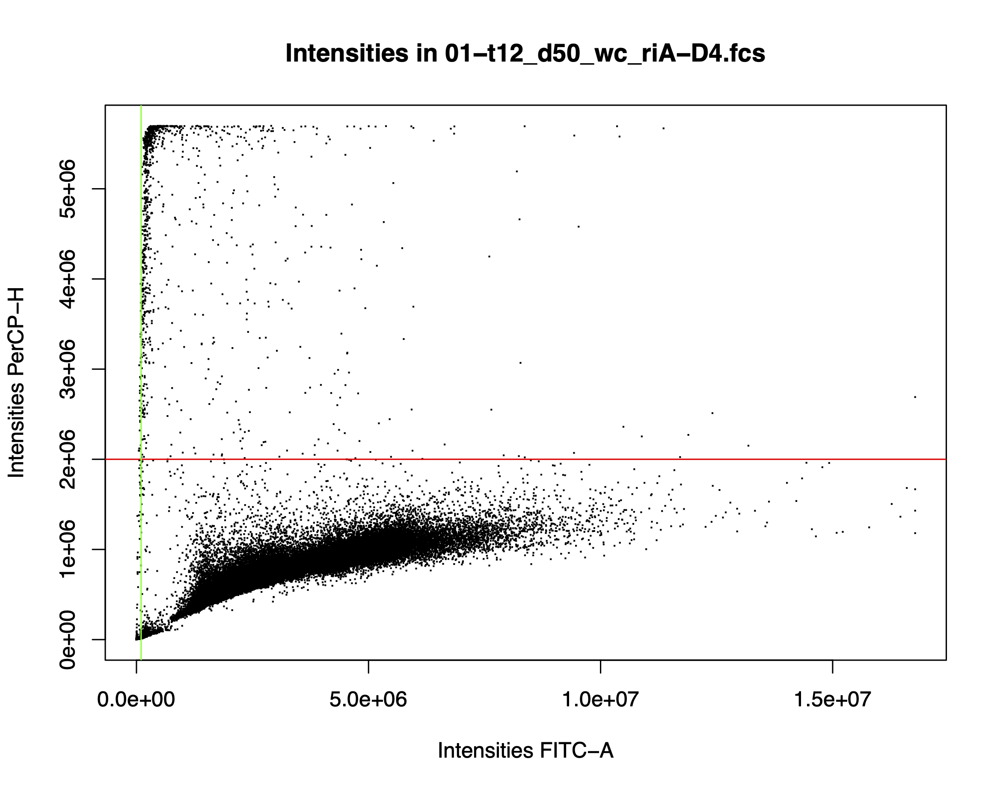

Graphical User Interface
============

## Introduction
For the tutorial, we will use flow cytometry files coming from a growth experiment with two gut bacterial species, *Roseburia intestinalis* (RI) and *Bacteroides thetaiotaomicron* (BT). These two species were grown in mono- and co-culture for up to 120 hours, as shown below:

In this experiment, dead/live staining with propidium iodide and SYBR-Green was applied. 
Propidium iodide is a stain that enters cells with broken membranes, which we therefore count as dead. 
SYBR-Green is a DNA-binding molecule that helps distinguish cells from background particles that do not contain DNA. 
Thus, viable cells should stain green and not red.

If you are interested in the biological background of the experiment, please check out the 
[article](https://www.nature.com/articles/s41396-023-01501-1).

The flow cytometry data for the growth curves shown above are available at 
[flowrepository.org](https://flowrepository.org/id/FR-FCM-Z6YM).
We are going to work here only with one time point (50 hours). You can find the files used in the tutorial 
[here](http://msysbiology.com/documents/CellScanner/CS2TutorialFiles.zip). 
 

When you open CellScanner, you see the graphical user interface (GUI) shown below. Please be patient, opening the GUI can sometimes take a minute. For further information on how to install CellScanner, you may have a look [here](./install.md).

## Import Data
The first step is to import the data. Flow cytometer (fcs) files are basically large tables with events (particles or cells) as rows and measurements in different channels as columns. Blanks are fcs files collected for the cell-free medium. A monoculture file is an fcs file for a single species, ideally inoculated in the same medium used for the blank.
We will now read these files into CellScanner.
For this, click on **"Import Data"** to open the panel dedicated to data import tasks. When you click the *Select blank file* button, you can navigate to the corresponding fcs files. When you click the *Add Species* button, a new button appears next to a text field that allows you to assign the name to the fcs files belonging to the same species.
Note that **you can select several files at once** for both blank and monoculture files! 
Optionally, you can also specify an output directory where results will be saved. 
If you do not specify one, results will go in an output folder created on the fly inside the CellScanner directory. 
If you previously trained a model for your data, you can also re-use it. Here, we work with two blank files and three biological replicates for each monoculture, with the samples collected at 50 hours. Thus, three files are loaded for each species. 

 

## Train Model
Next, we open the **Train Model** panel. 
If the CellScanner window becomes too big for your screen, close the **Import Data** panel. 

UMAP is run first to improve the separation between the monocultures and the blanks. Monoculture events that resemble blank events or events in other monocultures will disturb the classification and should be removed. This is in essence what UMAP does. It embeds events in a space defined by the flow cytometry measurements. We then identify the nearest neighbors of each event in that space. An event is filtered if less than the specified number of neighbors in the UMAP embedding have the same label (i.e. the same monoculture or blank).  

Next, a model (a neural network) is trained on the filtered monocultures and blanks. The number of events used for training is another parameter and is specified per file. Thus, if several fcs files were provided per species, the number of events considered for training is the file number per species times the specified parameter. The number of folds determines into how many sub-sets the data will be partitioned for training and testing. By default, there is no such partitionining and training is carried out on 80% of the events. The epoch number specifies how often the model is trained on the data and the early stopping criterion determines after how many training rounds the model should stop in case its performance no longer improves. Here, we are going to use the default values for UMAP and the neural network as shown below. 
You can **launch the model training step by clicking on** the green **Train** button.

 

**Optionally**, you can **apply gating** to the monocultures, which is then carried out before UMAP. If you wish to do so, please click the *Apply line gating* checkbox. In this example, as mentioned above, samples were treated with SYBR Green and propidium iodide. The latter is a red flurescent stain that cannot pass the cell membrane. Thus, it can enter cells only if their membrane is ruptured and cells stained red are therefore treated as dead.
In contrast, SYBR Green is a membrane-permeable green fluorescent stain that binds to DNA. Thus, any event that is not green does not contain DNA and should better not be counted as a cell. The thresholds have to be specified as a function of the intensity values for the corresponding channels across all monocultures. Usually, the software accompanying your flow cytometer can visualise intensities in different channels as histograms and scatter plots, thereby helping you to select thresholds. Here, we will set the thresholds as follows:

 

The plot below illustrates the gating carried out. FITC and PerCP  refer to the green and red fluorescence channel, respectively (A and H stand for area and height of the fluorescence signal). All events above the red line and all events to the left of the green line will be treated as dead cells or debris respectively and removed. The dead-cell filter is chosen leniently here to make sure that only cells with a strong red signal are treated as dead.

Model training should be fast (within one minute). 
Model performance files will be stored in a sub-folder in your specified output folder (if you did not specify one, then in the CellScanner folder, in `cellscanner/scripts`). 
The sub-folder name starts with `working_files` and ends with a time stamp. Please note that if training is rerun, training result files can be overwritten if no new output folder is specified.
The `working_files` folder contains the input files and another folder called `model`, in which you will find a number of files encoding the trained neural network, a file called `model_statistics.csv` and two html files, `umap_Before_filtering.html` and `umap_After_filtering.html`, which will open in your browser when clicked. 
The first shows a UMAP projection before and the second one after filtering of events. 
The **`model_statistics.csv` file contains information about classification performance, including accuracy, precision, recall, F1 score and the confusion matrix**.

This is the confusion matrix for our tutorial files:

| Species | Blank | BT | RI | 
| ----------- | ----------- | ------- | ----|
| Blank | 84 | 0 | 0 | 
| BT | 0 | 592 | 2 | 
| RI | 0 | 1 | 591 | 

The confusion matrix is computed by creating in-silico communities with known composition and feeding them to the trained model. It shows how well each species is separated from the other species and from debris (blank). Here, the model performed very well, with only a few events that were misclassified. 

This separation is also seen in the UMAP space plotted in `umap_After_filtering.html`, as shown below. In the html file, the plot is interactive and you can click on the label to hide the corresponding events from the plot.

## Run prediction
We are now ready to apply the trained neural network on one or several cocultures. 
For this, we open the **Run Prediction** panel by clicking on it. 
As with monocultures, several coculture files can be selected and imported at once. 
If more than one coculture is selected, the trained neural network will be applied to each coculture in turn. 
Here, we are importing six replicates of the coculture (btriA-btriF). 

Next, we specify three flow cytometer channels to be used in the visualization. Here, these are the forward scatter (FSC), side scatter (SSC) and green fluorescence (FITC) channel.

**Optionally, the "uncertainty" thresholding can be enabled** by clicking the checkbox next to 
*"Apply filtering on the predictions based on their uncertainty scores"*. 
Events that cannot be easily assigned to one species (or blank) have a high **uncertainty** (entropy).
CellScanner automatically computes an uncertainty threshold that maximizes model performance and displays it in the field next to the checkbox for uncertainty filtering. If uncertainty thresholding is enabled, events with uncertainty above this threshold will be filtered out. Note that the threshold can be manually adjusted. 

Optionally, line gating can also be applied to the coculture. Here, we are going to use the same thresholds as for the monocultures.

Clicking *"Predict"* will then launch the prediction step. 

 

The prediction should also happen within one minute. The output is stored in a folder called "Prediction" (followed by a time stamp) that is either located in the specified output folder or the `CellScanner/cellscanner/scripts` folder. For each coculture, the following files are generated (file names start with coculture name): 

- `3D_coculture_predictions_species.html` plots events in a 3D plot spanned by the three selected flow cytometer channels and colors them by species
- **`prediction_counts.csv`**, which contains the predicted counts for debris (blank), for each species, and also for the unknown events if uncertainty thresholding was enabled
- `raw_predictions.csv`, which is the fcs file of the coculture extended with prediction results (labels and, if enabled, uncertainties) 

In addition, three subfolders are created:

- subfolder `gated` contains 3D plots for different gating categories depending on gating input parameters as well as `raw_gating.csv`, which is the input file with labels resulting from gating appended
- subfolder `heterogeneity_results` quantifies overall and species-specific heterogeneity, for each coculture separately as well as for all co-cultures together in a merged file called `merged_heterogeneity_results.csv`
- subfolder `uncertainty_counts` is created when an uncertainty filter was specified and contains two files for each co-culture, namely `3D_coculture_predictions_uncertainty.html` with a 3D plot in which events are colored by uncertainty and `uncertainty_counts.csv`, which lists the number of uncertain events per label 

If more than one coculture file was provided, **`merged_prediction_counts.csv`** will list the counts in the different categories for each coculture. 

Below is the final result for the six coculture replicates (found in `merged_prediction_counts.csv`):

| Species | Coculure A | Coculture B | Coculture C | Coculture D | Coculture E | Coculture F |
| ----------- | ----------- | ------- | ----| -----| ---- | ------ | 
| BT_debris | 7035.0 | 4779.0 | 4320.0 | 6514.0 | 40316.0 | 19945.0 |
| **BT_live** | 132000.0 | 152150.0 | 135189.0 | 135168.0 | 111288.0 | 122545.0 |
| RI_debris | 238.0 | 90.0 | 251.0 | 214.0 | 376.0 | 366.0 |
| **RI_live** | 76367.0 | 36993.0 | 84986.0 | 71656.0 | 90392.0 | 86118.0 |
| RI_dead | 957.0 | 1371.0 | 1163.0 | 1002.0 | 895.0 | 867.0 |
| Blank_debris | 602.0 | 631.0 | 641.0 | 547.0 | 675.0 | 621.0 |
| Blank_notdead | 40.0 | 74.0 | 29.0 | 34.0 | 179.0 | 87.0 |
| Unknown | 3592.0 | 3507.0 | 3995.0 | 3413.0 | 6205.0 | 5126.0 |

This table classifies the co-culture events in a number of categories.
The neural network was trained to distinguish not only species from each other but also from events in the blanks (which do not contain cells). Events labeled as `blank` are therefore co-culture events that the neural network thought are too similar to events encountered in blanks. 
`debris` refers to events filtered out after classification because their signal was too weak in the specified channel (here FITC-A) and `dead` refers to events with a strong red signal that means that the cell membrane was compromised. Both categories only appear if the corresponding stains were specified.
Finally, `unknown` are events that could not be clearly classified by the neural network as a species or a blank. 
The order of these filters is as follows: only events that are not unknown can be classified as debris and only events not classified as debris can be classified as live or dead. The total count of events in a coculture sample is independent of the specified filters.

The total cell count can be obtained by summing the dead and live cell counts. Of note, no dead Bacteroides cells were detected with the lenient dead-cell threshold specified here and therefore the live cell count is equal to the total cell count in this case.

Thus, at 50 hours, the coculture is dominated by *Bacteroides thetaiotaomicron* according to CellScanner. 

